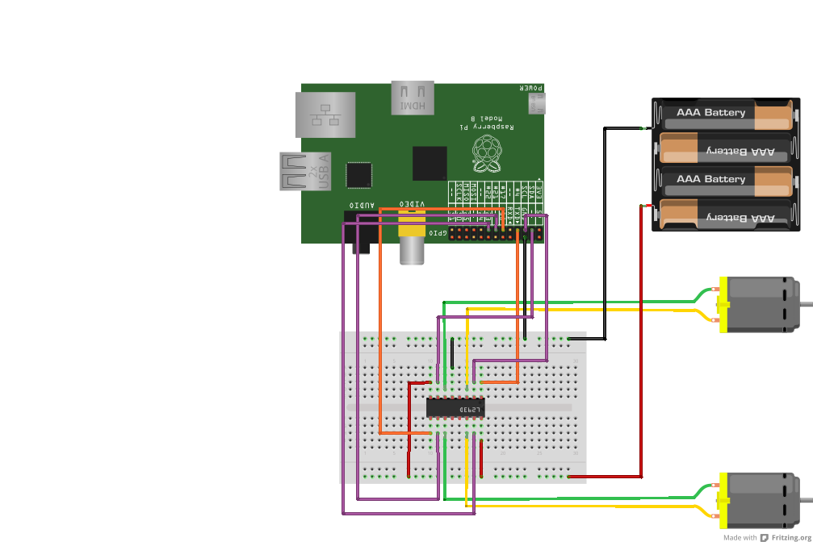

# Buggy build instructions

# Get the parts

You will need:

*  some [male to male wires](oomlout)
*  some female to male wires
*  4 AA battery holder and 4 *rechargable batteries*
*  small breadboard
*  buggy unit
*  pen and bluetack

# Build the circuit

follow this diagram to build the circuit

