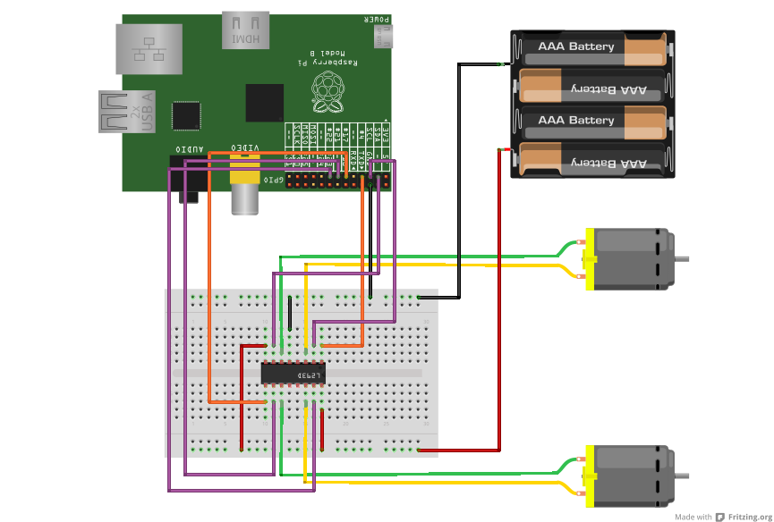

# Buggy build instructions

# Get the parts

You will need:

*  some [male to male wires](http://oomlout.co.uk/products/jumper-wires-70-piece)
*  some [female to male wires](http://oomlout.co.uk/products/premium-female-to-female-jumper-wires-x21)
*  [l293d motor driver](http://oomlout.co.uk/products/motor-controller-l293d)
*  [400 point breadboard](http://oomlout.co.uk/collections/prototyping/products/breadboard-400-point)
*  4 AA battery holder and 4 *rechargable batteries* *TODO*
*  [buggy unit](http://www.mindsetsonline.co.uk/product_info.php?cPath=17_134_685&products_id=1034)
*  pen and bluetack if you want to do some drawing.

# Tools required

* flat screwdriver
* pliers
* soldering iron? *TODO*

# Build the buggy

Follow the instructions that came with the buggy, but don't put the wires through the central hole. Also, don't connect the switches to the motors. We'll use the l293d chip to control the motors instead.

# Build the circuit

Follow this diagram to build the circuit, but don't insert the batteries yet. The most important parts to get right are:

*  The black and red connections from the battery holder need to be the right way round.
*  The l293d chip needs to be the right way round - the little notch should be on the right.

The l293d is the chip that amplifies the small current from the raspberry pi to the larger current we need to drive the motors. It also lets us drive the motors forwards and backwards. You can learn more about the [l293d here.](http://www.ti.com/lit/ds/symlink/l293d.pdf)

# Setup the software on the Raspberry pi

## Log in to the raspberry pi

*TODO*
You will need to power up the raspberry pi and connect to it over the network.

## Download the buggy software

On the raspberry pi, start a terminal. Then run these commands to download the software:

    wget https://github.com/mattvenn/raspi-buggy/archive/master.zip
    unzip master.zip

Then we need to install some extra software for the buggy software to work.

## easy_install

easy_install makes it easier to install python libraries.

    sudo apt-get -y install python-setuptools

## RPIO

RPIO is the library that lets a python program control the raspberry pi GPIO pins - which we'll use to drive the motor chip.

    sudo easy_install RPIO

## scratchpy

scratchpy is the library we'll use to talk to scratch

    sudo easy_install scratchpy

## Test the motors

Change into the buggy directory:

    cd buggy-master

Then start the test running by running this command:

    sudo python buggy_demo.py

If all is well, the program will start printing lines like this:

    Using hardware: PWM
    PW increments:  10us
    stop
    0 of 10
    straight
    left forward pwm: 570
    right forward pwm: 570
    stop
    pause

If you don't see the above then you probably have missed out [installing one of the libraries](#download-the-buggy-software)

You can then connect the batteries, and providing your circuit is correct the buggy should start moving its motors!

The test will run 10 times, to stop the test early, you can press control-C

You can look at what the test does by using an editor:

    nano buggy_demo.py

It drives the motors in different directions to perform a sequence of moves: a straight line, a turn and then an arc. This is done 10 times. You can learn more about how the program works by reading [buggy.py](#buggy.py)

# Scratch

To use scratch to control the buggy, we run scratch on a different computer, and then send commands from scratch to the raspberry pi. To do that we need to use scratch's mesh function, which allows scratch to talk over the network to the raspberry pi.

The reason why we don't run scratch on the pi and then connect via [VNC](http://en.wikipedia.org/wiki/Virtual_Network_Computing) is that we've found it's too slow and annoying for children (and adults!) to use. We could connect a keyboard, mouse and screen to the raspberry pi, but then the robot wouldn't be very free to drive around.

## Configure scratch for mesh

Follow the [instructions here](http://wiki.scratch.mit.edu/wiki/Mesh#Mesh_by_Modification_of_Scratch) to enable mesh on scratch. 

Then [host Mesh](http://wiki.scratch.mit.edu/wiki/Mesh#How_to_Host_and_Join_Mesh_sessions). 

## Start Raspberry pi listening to scratch

We run the scratch_listener.py program on the raspberry pi to listen to the command from scratch. To do that, we need the IP address of the computer running scratch. [Follow these instructions to find your IP address.](http://computer.howstuffworks.com/internet/basics/how-to-find-ip-address.htm)

Then start the scratch_listener program like this (change IP_ADDRESS to your IP address)

    sudo python scratch_listener.py IP_ADDRESS

You should see this:

    Using hardware: PWM
    PW increments:  10us
    trying to connect to IP_ADDRESS : 42001
    connected

If you see this:

    Using hardware: PWM
    PW increments:  10us
    couldn't connect - is scratch running?
    [Errno 111] Connection refused

Then either scratch isn't setup for mesh networking, the mesh network isn't enabled, or you have the wrong IP address.

## Test the scratch connection

Download [the example buggy.sb scratch program](https://github.com/mattvenn/raspi-buggy/blob/master/buggy.sb?raw=true). And then load it in scratch.

Try pressing the arrow keys on your keyboard. Each arrow key should move a motor in one direction. You can press 2 buttons at once to use both motors. Now you can write your own scratch programs to draw some fun patterns!

# Controlling the buggy with Python

Controlling the buggy with python is easy. Log in to the raspberry pi and change to the buggy directory:

    cd buggy-master

Then have a look at the buggy_demo.py program. You can copy this program and change what happens. Then try out your changes by running the program again:

    sudo python buggy_demo.py

## buggy.py

buggy.py is a little library that sets up the GPIO pins and defines 2 functions that allow easy control of the motors. The first is called:

    buggy.drive(wheel,speed)

It takes 2 arguments, the wheel to control, and the speed to move the wheel at. The wheel is chosen by passing either buggy.LEFT or buggy.RIGHT. The speed can be set to -100 to +100. A speed of 0 will stop the motor. 

The second is used to stop both motors:

    buggy.stop_all()

To find out more about RPIO and how PWM works to control the motors at different speeds, you can read the [documentation here.](http://pythonhosted.org/RPIO/)

# Photos

Some [photos of the buggy and the pictures that it has drawn.](http://www.flickr.com/photos/matthewvenn/sets/72157633441674047/with/9027093148/)
